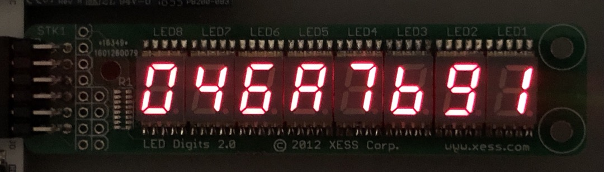

# vvmods
Various Verilog Modules

## [StickIt! LED Digits](https://xess.com/manuals/StickIt-LedDigits-manual-v2_0.pdf) with PMOD header

[stickit.v](https://github.com/metebalci/vvmods/blob/main/stickit.v) displays a 32-bit value on 8x 7-segment display unit (StickIt!) with 8 pins (PMOD) using [Charlieplexing](https://en.wikipedia.org/wiki/Charlieplexing).

Tested with Xilinx Vivado 2020.2 running on Spartan-7.

